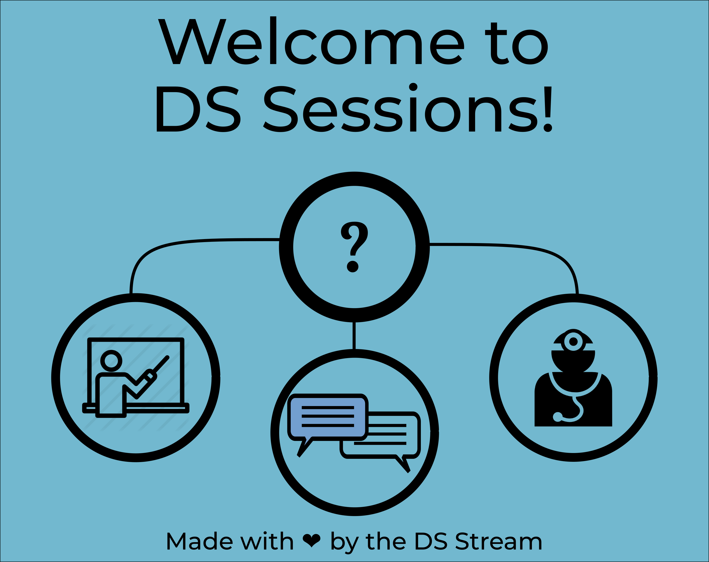

# DS sessions


# Important

Please, take a minute to fill in this [form](https://forms.gle/unt2MsBZr9SP2oTu9) and evaluate the DS helper team. This is the only way I can improve it!!
# Update on Lectures
Hi Everyone!! 

The next lecture will on Wednesday 14/04 at 14. It will be the second part of the introduction to R (statistical analysis) 
To access the lecture this is the [link](https://teams.microsoft.com/l/meetup-join/19%3ameeting_MTFjOGQ0NDQtNjEwOS00NjY5LWJiM2QtNzc3MzZmNDg1NzU5%40thread.v2/0?context=%7b%22Tid%22%3a%222b897507-ee8c-4575-830b-4f8267c3d307%22%2c%22Oid%22%3a%2259f6bab9-038b-4d99-ba0a-7617d7a16f65%22%7d).
Hope to see many of you there!

Here the [material](https://colab.research.google.com/drive/1oUEA6lefrXeU4VHUyKnX94fBF6CZ2kcI) for the lecture!


The clinic sessions are still taking place. Just book a spot using this [form](https://forms.gle/VaZb9oivXJ2bP4t47) and we will do our best to help you :) 

# Update on Clinic Sessions

Do you have a question that requires a longer explanation? 
Fill in this [form](https://forms.gle/VaZb9oivXJ2bP4t47), select the days you could be available, and we will try to set up a 30 minutes call with one of the students of the DS helper team. 

## Having issues downloading the Lecture materials?

There are two options for you to download the material:

---OPTION 1---

Downloading stuff from github can be a bit confusing at first. The easiest way to do it is by copying and pasting the text directly in your RStudio.

Example: Exercises file (`Exercises.Rmd`)

- Navigate this GitHub repository until you reach `DS_sessions/Lecture_Material/1301_Introduction_to_R/Exercises.Rmd`, or [click here](https://github.com/valegiunchiglia/DS_sessions/blob/main/Lecture_Material/1301_Introduction_to_R/Exercises.Rmd)
- Once you see the code window, select everything in the window and copy it
- Open RStudio and go to File > New File > R Markdown... give it a title and click `OK`
- A new file will appear in your Scripts panel (top left) with a bunch of text and code
- Delete the text from the default template code and paste the code you copied from our website instead


That's it! `Exercised.Rmd` will guide you through this new format: R Markdown, which combines text and code in a single document.

---OPTION 2---
1. Open the **terminal** on your laptop
2. Move to your Desktop directory by using cd (probably it's enough to write **cd Desktop**)
3. Write git clone https://github.com/valegiunchiglia/DS_sessions.git

Now you should have a folder in your desktop with all the material. You have to do it only once. In order to than update it with the new files in the github, you have to do the following.

1. Open the **terminal**
2. Move into the DS_sessions folder 
3. Write git pull origin main
4. Give your github account name and password. 

------------------------------------

Hey Everybody!

Welcome to the github repository for the sessions organized by the Data Science Helper team!
Here I will give you a brief overview of how everything will work. 

The project consists of three parts:
* **Introductory Lectures:** the members of the DS Helper team will try to give introductory lectures on the topics that you selected as the most interesting during the survey. The lectures might consist on powerpoint presentations, tutorials or coding practicals. The material of the lectures will be uploaded in this page at least one day before the lecture, so that you will have all the time you need to set up your computer, and download data/packages. In this way, the lectures can be potentially more interactive! Information about the topics of the lectures will be posted on github under *Schedule_sessions.md*, together with the Teams Link for the sessions. Some sessions are already scheduled, check them out! 
* **Clinic sessions:** during these sessions you have the possibility to book a slot of maximum 20 minutes with 1 or 2 DS students of the helper team. These sessions are thought to help in case you have questions that require a face to face assistance, or a longer explanation. You will be able to book a slot through the form at this [link](https://forms.gle/VaZb9oivXJ2bP4t47).
* **Discussion Forum:** at the top of this page you can find a Discussions tab. There you can post ALL the questions you have. This is thought for the questions that require a more urgent reply (and can't wait for the following clinic session), or that don't necessariliy need a face to face meeting. Just post your question there by opening a new discussion, and the students of the DS helper team will try to help. For further information, read the "Welcome to DS_sessions" in the Discussion section.

**For some introductory lectures, it will be reccomended to download some packages/softwares. If you might have any issue setting up your laptop, please post a question in the Discussion forum and we will get back to you.**
 
## Practical information:

Both the clinic sessions and introductory lectures will take place on:
```
When: Wednesdays
Time: Might change (check Schedule_sessions.md for more info)
Where: on Teams
```

<ins>Please, do remember that we do this on a voluntary basis, and simply because we would like to help. So no lectures, sessions or answer is actually guaranteed and is strictly based on our availability. This means that potentially there might be peiods of time when sessions take place once a week, and your answers on the Discussion forum are replied quickly enough. But also periods when no sessions take place, and your questions are not replied to. After all, the master and our own project is still our first priority.</ins>
